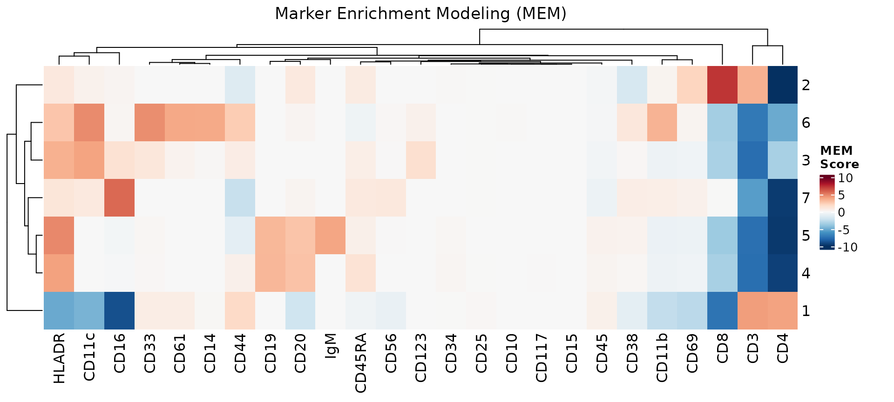
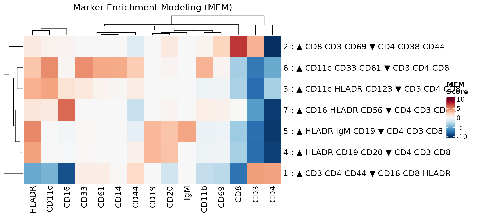
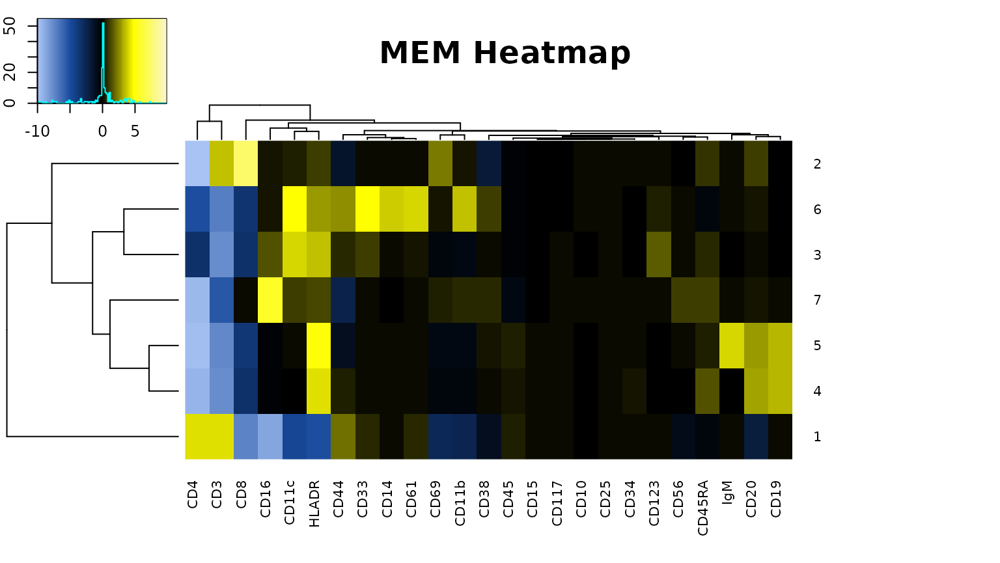
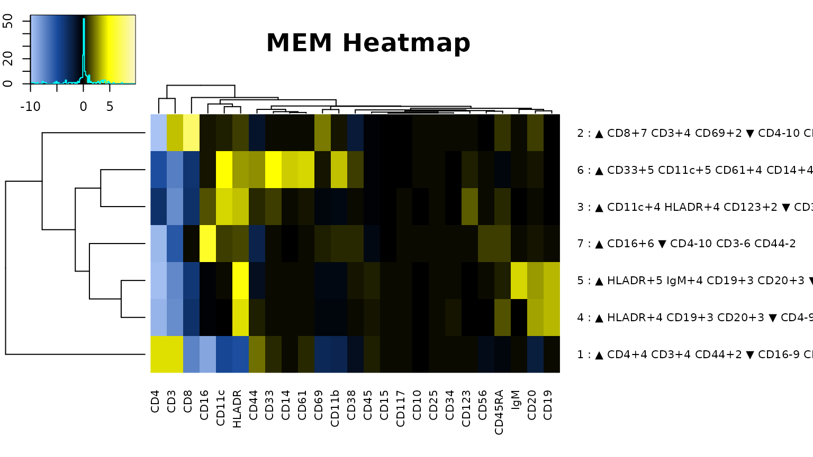

# Introduction to altmem

## Installation

Install altmem.

``` r
BiocManager::install("igordot/altmem")
```

## Usage

Load altmem.

``` r
library(altmem)
```

### Prepare input data

Load an example cytoMEM dataset from the mass cytometry characterization
of normal human blood.

``` r
data(PBMC, package = "cytoMEM")
str(PBMC)
#>  num [1:30000, 1:26] 228.39795 -0.13233 -0.05275 -0.00692 -0.13046 ...
#>  - attr(*, "dimnames")=List of 2
#>   ..$ : chr [1:30000] "34776" "24019" "16288" "20080" ...
#>   ..$ : chr [1:26] "CD19" "CD117" "CD11b" "CD4" ...
```

``` r
head(PBMC)
#>                CD19      CD117      CD11b         CD4        CD8        CD20
#> 34776 228.397949219  7.5046458 -0.9150130  -0.2774475 19.5639267 72.83031464
#> 24019  -0.132328644 -0.3033659  1.8847632 210.0684814  9.7968664 -0.08022045
#> 16288  -0.052747775 -0.3950237  5.6076398 279.7434692  0.7161499 -0.28644082
#> 20080  -0.006922856 -0.6971378  0.8639542 222.2871552  4.8340611 -0.50484931
#> 2795   -0.130458266 -0.5786674 -0.5515317 168.1178284  6.4676809 -0.30329800
#> 42843  -0.455609500 -0.9955425 19.5426483  -0.4268070  3.4530685 -0.20784166
#>             CD34        CD61       CD123     CD45RA     CD45       CD10
#> 34776 12.5207195 -0.40058744 -0.07129496  82.092789 689.7737  5.1752467
#> 24019 -0.6508371 -0.84006447 -0.17981683   8.382261 488.5262 11.5378046
#> 16288 -0.3778218  2.26188397 -0.58151388 214.990265 946.5264  5.1995435
#> 20080 -0.1224543 -0.09539251 -0.60980731  20.322187 619.9553 -0.7068613
#> 2795  -0.3869398  0.67348033 -0.55655158 152.076248 346.0350 -0.5322152
#> 42843 -0.2831804 -0.08337180 -0.33748615  60.164875 576.0743 -0.8543764
#>             CD33      CD11c       CD14        CD69       CD15        CD16
#> 34776  5.5634279 -0.6485761 -0.1669585  0.53545767  1.8927699  -0.5835396
#> 24019 -0.1477257 -0.7465935  3.0520153 -0.40952709 -0.8505481   6.1292162
#> 16288 -0.8284602 -0.1544797 -0.6179111 -0.63483632  0.1009932  -0.3244779
#> 20080  0.8591875 -0.8049483 -0.8027710  8.82421875 -0.1086400   4.5313282
#> 2795  -0.6559110 -0.7710050  0.4461933  0.69180661 -0.7268596  -0.8876948
#> 42843 -0.0539494 -0.7829651 -0.4304854 -0.03877449  2.6627660 844.5389404
#>            CD44      CD38        CD25         CD3         IgM      HLADR
#> 34776  84.50186 31.794935  1.29871488  -0.5886221 74.17253113 91.3828659
#> 24019 397.93457 11.492667  2.99961948  64.7258148 -0.80473328 -0.4379718
#> 16288 325.31021 25.313175  1.62456477 292.4138489 -0.02986890  0.6092911
#> 20080 483.35672 13.429344 15.27015018  99.1597366  0.08114051 -0.6701981
#> 2795  103.83817 35.024025  1.58465934  96.7151718 -0.48192909 17.5168056
#> 42843  72.14079  4.988808 -0.05385961   3.1720824 -0.40776855 -0.9950773
#>              CD56 cluster
#> 34776 -0.04730700       5
#> 24019 -0.09216285       1
#> 16288  0.20110747       1
#> 20080 -0.70026368       1
#> 2795  -0.81669140       1
#> 42843  6.11005735       7
```

Seven cell populations were identified (the labels are stored in the
`cluster` column):

- 1: CD4+ T cells
- 2: CD8+ T cells
- 3: dendritic cells (DCs)
- 4: IgM- B cells
- 5: IgM+ B cells
- 6: monocytes
- 7: natural killer (NK) cells

This dataset is not transformed, so we will apply an arcsinh
transformation with a cofactor of 15.

``` r
PBMCt <- PBMC[, colnames(PBMC) != "cluster"]
PBMCt <- asinh(PBMCt / 15)
PBMCt <- cbind(PBMCt, cluster = PBMC[, "cluster"])
```

### Run altmem

Run marker enrichment modeling.

``` r
res <- altmem(PBMCt, cluster_col = "cluster")
```

Alternatively, the transformation can be done within the MEM function.

``` r
res <- altmem(PBMC, cluster_col = "cluster", transform = TRUE, cofactor = 15)
```

The output is a list of matrices containing the MEM scores and related
statistics.

``` r
str(res)
#> List of 6
#>  $ MAGpop    :List of 1
#>   ..$ : num [1:7, 1:25] 2.5086 0.0251 0.0287 2.5251 0.0185 ...
#>   .. ..- attr(*, "dimnames")=List of 2
#>   .. .. ..$ : chr [1:7] "5" "1" "7" "4" ...
#>   .. .. ..$ : chr [1:25] "CD19" "CD117" "CD11b" "CD4" ...
#>  $ MAGref    :List of 1
#>   ..$ : num [1:7, 1:25] 0.0231 0.0143 0.0185 0.021 0.0206 ...
#>   .. ..- attr(*, "dimnames")=List of 2
#>   .. .. ..$ : chr [1:7] "5" "1" "7" "4" ...
#>   .. .. ..$ : chr [1:25] "CD19" "CD117" "CD11b" "CD4" ...
#>  $ IQRpop    :List of 1
#>   ..$ : num [1:7, 1:25] 0.649 0.5 0.5 0.641 0.5 ...
#>   .. ..- attr(*, "dimnames")=List of 2
#>   .. .. ..$ : chr [1:7] "5" "1" "7" "4" ...
#>   .. .. ..$ : chr [1:25] "CD19" "CD117" "CD11b" "CD4" ...
#>  $ IQRref    :List of 1
#>   ..$ : num [1:7, 1:25] 0.5 0.5 0.5 0.5 0.5 0.5 0.5 0.5 0.5 0.5 ...
#>   .. ..- attr(*, "dimnames")=List of 2
#>   .. .. ..$ : chr [1:7] "5" "1" "7" "4" ...
#>   .. .. ..$ : chr [1:25] "CD19" "CD117" "CD11b" "CD4" ...
#>  $ MEM_matrix:List of 1
#>   ..$ : num [1:7, 1:25] 3.3093 0.0144 0.0136 3.3341 -0.0029 ...
#>   .. ..- attr(*, "dimnames")=List of 2
#>   .. .. ..$ : chr [1:7] "5" "1" "7" "4" ...
#>   .. .. ..$ : chr [1:25] "CD19" "CD117" "CD11b" "CD4" ...
#>  $ File Order:List of 1
#>   ..$ : num 0
```

After the labels are calculated, we can visualize the results.

``` r
mem_heatmap(res)
```



The heatmap can be further customized: `show_mem_labels` adds the
descriptive MEM labels to the cluster names,`max_label_markers` limits
the number of markers shown in the labels, and `min_heatmap_score` adds
a threshold for keeping only variable markers.

``` r
mem_heatmap(res, show_mem_labels = TRUE, max_label_markers = 3, min_heatmap_score = 2)
```



The MEM scores and labels agree with the known biology of these cell
populations. For example, cluster 1 (CD4+ T cells) is enriched for CD4
and CD3, while cluster 2 (CD8+ T cells) is enriched for CD8 and CD3.

The labels can be extracted as a simple vector.

``` r
mem_labels(res, min_label_score = 1, max_label_markers = 5, show_label_scores = FALSE)
#>                                                   5 
#>           "5 : ▲ HLADR IgM CD19 CD20 ▼ CD4 CD3 CD8" 
#>                                                   1 
#>    "1 : ▲ CD3 CD4 CD44 ▼ CD16 CD8 HLADR CD11c CD69" 
#>                                                   7 
#> "7 : ▲ CD16 HLADR CD56 CD11c CD45RA ▼ CD4 CD3 CD44" 
#>                                                   4 
#>        "4 : ▲ HLADR CD19 CD20 CD45RA ▼ CD4 CD3 CD8" 
#>                                                   2 
#>     "2 : ▲ CD8 CD3 CD69 HLADR CD20 ▼ CD4 CD38 CD44" 
#>                                                   3 
#>   "3 : ▲ CD11c HLADR CD123 CD16 CD33 ▼ CD3 CD4 CD8" 
#>                                                   6 
#>    "6 : ▲ CD11c CD33 CD61 CD14 CD11b ▼ CD3 CD4 CD8"
```

## cytoMEM workflow

For comparison, we can run the same analysis using the original cytoMEM
package.

``` r
cytomem_res <- cytoMEM::MEM(PBMC, transform = TRUE, cofactor = 15)
```

As expected, the initial `MEM()` output is the same as
[`altmem()`](https://igordot.github.io/altmem/reference/altmem.md).

``` r
identical(res, cytomem_res)
#> [1] TRUE
```

We can also generate the cytoMEM heatmap.

``` r
cytoMEM::build_heatmaps(cytomem_res, only.MEMheatmap = TRUE)
```



    #> [1] "MEM label for cluster 2 : ▲ CD8+7 CD3+4 CD69+2 CD20+1 CD45RA+1 HLADR+1 ▼ CD4-10 CD38-2 CD44-1"                                         
    #> [2] "MEM label for cluster 6 : ▲ CD33+5 CD11c+5 CD61+4 CD14+4 CD11b+3 CD44+3 HLADR+3 CD123+1 CD38+1 ▼ CD3-7 CD4-5 CD8-3"                    
    #> [3] "MEM label for cluster 3 : ▲ CD11c+4 HLADR+4 CD123+2 CD45RA+1 CD33+1 CD16+1 CD44+1 ▼ CD3-8 CD4-3 CD8-3 CD11b-1"                         
    #> [4] "MEM label for cluster 7 : ▲ CD16+6 CD11b+1 CD45RA+1 CD11c+1 CD38+1 HLADR+1 CD56+1 ▼ CD4-10 CD3-6 CD44-2 CD45-1"                        
    #> [5] "MEM label for cluster 5 : ▲ HLADR+5 IgM+4 CD19+3 CD20+3 CD45RA+1 ▼ CD4-10 CD3-8 CD8-4 CD11b-1 CD69-1 CD44-1"                           
    #> [6] "MEM label for cluster 4 : ▲ HLADR+4 CD19+3 CD20+3 CD45RA+1 CD44+1 ▼ CD4-9 CD3-8 CD8-3 CD11b-1"                                         
    #> [7] "MEM label for cluster 1 : ▲ CD4+4 CD3+4 CD44+2 CD61+1 CD45+1 CD33+1 ▼ CD16-9 CD8-7 CD11c-5 HLADR-5 CD69-3 CD11b-2 CD20-2 CD38-1 CD56-1"

``` r
cytoMEM::build_heatmaps(cytomem_res, display.thresh = 2, labels = TRUE, only.MEMheatmap = TRUE)
```



    #> [1] "MEM label for cluster 2 : ▲ CD8+7 CD3+4 CD69+2 ▼ CD4-10 CD38-2"                                     
    #> [2] "MEM label for cluster 6 : ▲ CD33+5 CD11c+5 CD61+4 CD14+4 CD11b+3 CD44+3 HLADR+3 ▼ CD3-7 CD4-5 CD8-3"
    #> [3] "MEM label for cluster 3 : ▲ CD11c+4 HLADR+4 CD123+2 ▼ CD3-8 CD4-3 CD8-3"                            
    #> [4] "MEM label for cluster 7 : ▲ CD16+6 ▼ CD4-10 CD3-6 CD44-2"                                           
    #> [5] "MEM label for cluster 5 : ▲ HLADR+5 IgM+4 CD19+3 CD20+3 ▼ CD4-10 CD3-8 CD8-4"                       
    #> [6] "MEM label for cluster 4 : ▲ HLADR+4 CD19+3 CD20+3 ▼ CD4-9 CD3-8 CD8-3"                              
    #> [7] "MEM label for cluster 1 : ▲ CD4+4 CD3+4 CD44+2 ▼ CD16-9 CD8-7 CD11c-5 HLADR-5 CD69-3 CD11b-2 CD20-2"
